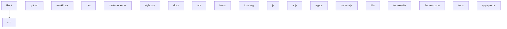

# 🚀 Scanner

**[EN]** Scanner project

**[ID]** Scanner project

---

[]()
[]()
[]()
[]()


---

## ✨ Features / Fitur

> **[EN]** Key features of this project.

> **[ID]** Fitur utama dari project ini.

<!-- Add your features here: -->
- Feature 1
- Feature 2

---

## 🏗️ Architecture / Arsitektur

**[EN]** Project structure overview.

**[ID]** Ikhtisar struktur project.

``
.github/
  workflows/
css/
  dark-mode.css
  style.css
docs/
  adr/
icons/
  icon.svg
js/
  ai.js
  app.js
  camera.js
  config.js
  edge-detection.js
libs/
test-results/
  .last-run.json
tests/
  app.spec.js
worker/
  .wrangler/
  index.js
  wrangler.toml
AGENTS.md
index.html
manifest.json
package-lock.json
package.json
playwright.config.ts
README.md
sw.js
``



---

## 🛠️ Tech Stack


---

## 🚀 Quick Start

### Prerequisites

* [](https://git-scm.com/)
* [](https://nodejs.org/)


### Installation / Instalasi

```bash
# Clone
git clone https://github.com/GrayZeus20/Scanner.git
cd Scanner

# Install dependencies / Install dependensi
npm install
```

### Development / Pengembangan

```bash
# Start dev server / Jalankan server development
npm start
```

### Build

```bash
# No build step
```

### Testing / Pengujian

```bash
# Add test script
```

---

## ⚙️ Configuration / Konfigurasi

**[EN]**
Copy .env.example to .env and fill in your configuration:


**[ID]**
Salin .env.example menjadi .env dan isi konfigurasi Anda:


```bash
cp .env.example .env

```

---

## 📜 Available Commands / Perintah Tersedia

| Script | Command |
|--------|---------|
| `IsReadOnly` | `False` |
| `IsFixedSize` | `False` |
| `IsSynchronized` | `False` |
| `Keys` | `test` |
| `Values` | `npx playwright test` |
| `SyncRoot` | `System.Collections.Hashtable` |
| `Count` | `1` |


---

## 📚 Documentation / Dokumentasi

- [0001 ui design](docs/adr/0001-ui-design.md)
- [0002 camera flash](docs/adr/0002-camera-flash.md)
- [0003 ai proxy](docs/adr/0003-ai-proxy.md)

---

## 🕒 Recent Changes / Perubahan Terbaru

* feat: refactor configuration management by introducing config.js for centralized settings; update various modules to use config values
* feat: optimize manual crop functionality by implementing caching for bounding rectangles and improving delta calculations for corner positioning
* feat: enhance manual crop functionality by improving crop handle styles and adding active scaling effect; update resetCropArea to reset zoom and pan
* feat: enhance cloud analysis by improving error handling and refining prompt logic; update OCR result validation
* feat: enhance manual crop functionality by implementing absolute corner positioning and delta calculations
* feat: add Playwright test framework and configuration
* feat: add remove button and drag-and-drop functionality for page thumbnails; enhance error handling in AI processing
* feat: improve accessibility by adding labels for language switcher and filter controls

---

## 🛡️ Security / Keamanan

**[EN]**
* API keys and secrets are never committed to Git.
* All .env files are git-ignored.
* Only .env.example with placeholder values is tracked.

**[ID]**
* API key dan rahasia tidak pernah di-commit ke Git.
* Semua file .env di-gitignore.
* Hanya .env.example dengan nilai placeholder yang di-track.

---

## 🤝 Contributing / Kontribusi

1. Fork this repository
2. Create a feature branch (git checkout -b feature/amazing-feature)
3. Commit your changes (git commit -m 'Add amazing feature')
4. Push to the branch (git push origin feature/amazing-feature)
5. Open a Pull Request

---

## 👤 Author / Pengembang

Dandi January

---

## 📄 License / Lisensi

MIT © 2026
